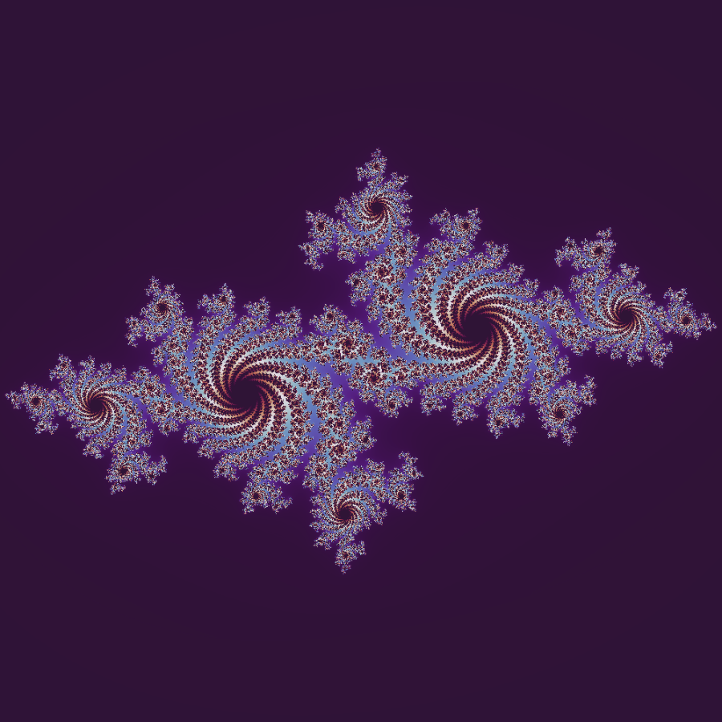
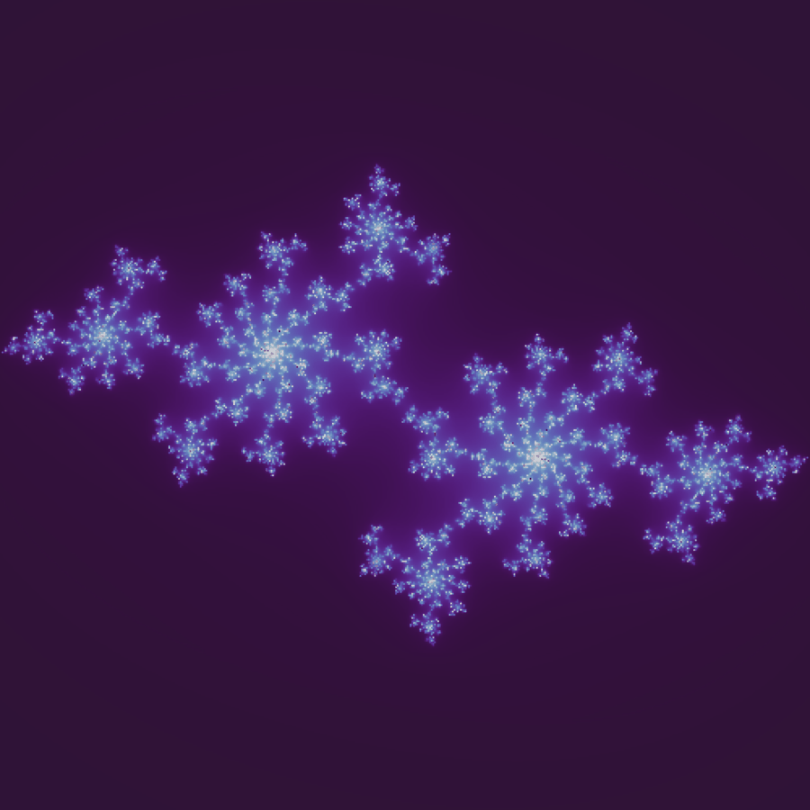

# Julia Set Fractal Generator

A Python implementation of the Julia set fractal, rendered with a smooth escape-time
coloring algorithm and a perceptual color gradient. Beyond a single static image, the
project also generates an animated GIF that morphs between several different Julia
constants, showing how the fractal's shape changes as the underlying parameter changes.

## Fractal Type Implemented
- **Julia Set** (smooth escape-time algorithm, complex quadratic map z → z² + c)

## Tools, Languages, and Libraries Used
- Python 3
- NumPy (vectorized escape-time computation)
- Matplotlib (colormap-based rendering)
- Pillow / PIL (image assembly and GIF animation)
- Google Colab (development/runtime environment)

## Setup and Run Instructions

### Option A — Google Colab (recommended, no installation needed)
1. Open [Google Colab](https://colab.research.google.com).
2. Upload `Julia_Set_Fractal.ipynb` (File > Upload notebook).
3. Run all cells: **Runtime > Run all**.
4. `julia_set.png` and `julia_animation.gif` will be generated and can be downloaded
   from the file browser on the left, or via the last cell.

### Option B — Run locally
```bash
pip install numpy matplotlib pillow
python julia_set.py
```

## Output

**Static render:**



**Animated version (cycling through multiple Julia constants):**



## Student Information
- Name: Zainab Saghir
- Registration Number: 550883
- Course / Lab: Artifitial Intelligence
